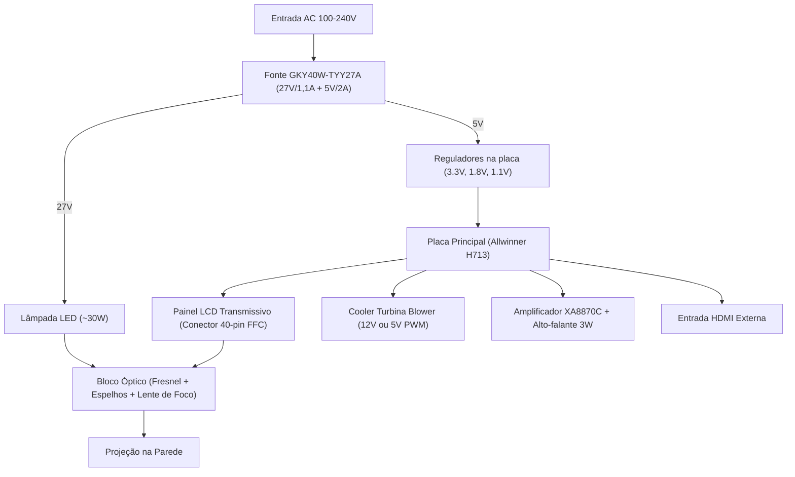

# Guia de Engenharia de Hardware & Upgrade com TV Box — Projetor HY300

Este documento analisa a arquitetura eletromecânica do projetor **HY300 / HY300 Pro**, orienta o reaproveitamento de componentes e detalha as estratégias para realizar upgrade ou transplante de placas lógicas utilizando placas de **TV Box** (Amlogic, Rockchip, Allwinner) e módulos eletrônicos avulsos.

---

## 1. Arquitetura Física e Componentes do HY300

O HY300 é construído em uma arquitetura modular compacta:

### Lista de Componentes Aproveitáveis:
1. **Bloco Óptico Completo:**
   - Lentes de Fresnel (polarizadora e condensadora).
   - Espelhos dicroicos internos e espelho refletor 45°.
   - Anel de foco mecânico manual e lente frontal de projeção.
2. **Display LCD:**
   - Tela TFT LCD transmissiva de alta densidade (~2.69 polegadas, resolução nativa 1280x720).
   - Conector: **FFC de 40 pinos** (interface paralela RGB TTL / LVDS de baixa voltagem).
3. **Sistema de Iluminação:**
   - Módulo LED COB de alta intensidade (luz branca neutra, 30W a 50W).
   - Dissipador de calor de alumínio aletado acoplado ao LED.
4. **Sistema de Refrigeração:**
   - Turbina / Blower centrífugo (mantém o ar fluindo através das aletas do LED e resfria a face do LCD).
5. **Fonte Chaveada Interna (medida nesta unidade):**
   - `GKY40W-TYY27A REV:A01`: **27 V / 1,1 A** para o LED e **5 V / 2 A** para a placa lógica. Não há 12 V nesta fonte.
6. **Alto-falante e Carcaça Articulada:**
   - Falante full-range 4 ohms / 3W.
   - Base cilíndrica com articulação de 180 graus.

---

## 2. Estratégia de Upgrade A: O "Mod Híbrido" (Recomendado)

Se a placa-mãe original com Allwinner H713 for recuperada via firmware, ela possui uma característica excelente: **uma porta HDMI IN nativa**.

### Por que esta é a melhor opção?
* O processador original H713 possui apenas 1GB de RAM, tornando o Android 11 lento para aplicativos pesados.
* Ao recuperar a placa original, você mantém todo o gerenciamento térmico (proteção de desligamento do LED caso o cooler pare, controle de rotação e keystone trapezoidal digital).
* Uma placa de TV Box potente (ex: Amlogic S905W2, S905X3, S905X4 ou Allwinner H616 com 2GB/4GB de RAM) roda liso qualquer streaming (Netflix, YouTube 4K, IPTV, Stremio).

### Como integrar a TV Box internamente no gabinete:
1. **Desmontagem da TV Box:** Remova a placa da TV Box de sua carcaça plástica original para reduzir volume.
2. **Alimentação:** A maioria das TV Boxes consome **5V / 1–2A**.
   - A fonte desta unidade só tem **5 V / 2 A**, e essa saída já alimenta a placa H713. Somar uma TV Box nela tende a estourar a capacidade.
   - Use uma **fonte 5 V separada** para a TV Box. Ou use um step-down (ex.: **MP1584EN**, **LM2596**) a partir dos **27 V**, ajustado para 5,1 V, desde que a soma com o LED caiba em ~30 W: meça com o multímetro antes.
   - **Nunca** ligue a saída de 27 V direto na TV Box.
3. **Sinal de Vídeo:**
   - Utilize um cabo flat flexível mini-HDMI / HDMI macho-macho ultrafino ou solde fios blindados curtos diretamente entre as trilhas HDMI da TV Box e a porta HDMI IN do projetor.
4. **Áudio:** O áudio será transmitido diretamente pelo HDMI para o amplificador interno e alto-falante do HY300.

---

## 3. Estratégia de Upgrade B: Transplante Total (Substituição da Placa Queimada)

Se a placa-mãe Allwinner H713 estiver fisicamente danificada (curto grave, processador ou eMMC queimados), é possível transformar o projetor em um **monitor/projetor HDMI universal** controlado pela sua TV Box:

### O Desafio Técnico:
* TV Boxes comuns **NÃO possuem saída de 40 pinos** para displays LCD diretos. Apenas emitem sinal **HDMI** ou vídeo composto analógico (AV RCA).
* O display LCD do HY300 necessita de sinais digitais de sincronismo (RGB / LVDS).

### A Solução: Placa Controladora HDMI Universal para LCD de 40 Pinos
Para conectar qualquer TV Box ou videogame no LCD do HY300, utiliza-se uma pequena **Placa Driver Controladora HDMI para 40 pinos FFC**:
* **Chips mais comuns:** Realtek `RTD2660`, `RTD2660H` ou MStar `MST6M182`.
* **Custo:** Módulos pequenos e acessíveis em lojas de eletrônica.
* **Conexão:** 
  `TV Box (Saída HDMI) ===> Placa Controladora (Entrada HDMI) ===> Cabo Flat 40 pinos ===> Display LCD do Projetor`

### Circuito de Acionamento da Lâmpada LED e Cooler:
Sem a placa original, o LED e o cooler precisam ser ligados manualmente ou acionados pela fonte:
1. **Cooler / Ventoinha (CRÍTICO):**
   > [!CAUTION]
   > O cooler DEVE ser ligado no exato instante em que o LED for ligado. Se a lâmpada LED acender sem o cooler rodando, a lente de Fresnel e o display LCD derreterão em menos de 60 segundos!
2. **Circuito de Proteção Térmica:**
   - Adicione um termostato bimetálico normalmente fechado (KSD9700 ou KSD01F) de **70°C** colado com cola térmica no dissipador do LED.
   - Ligue o termostato em série com a alimentação do driver do LED. Caso a ventoinha pare e a temperatura suba, o circuito corta a alimentação do LED imediatamente.
3. **Chave Geral:**
   - Um interruptor gangorra na carcaça ou um pequeno relé de 5V acionado pela porta USB da TV Box (assim, ao ligar a TV Box pelo controle remoto, a porta USB ativa o relé que liga o LED e o cooler do projetor simultaneamente).

---

## 4. Pinagem Típica do Cabo Flat LCD de 40 Pinos (Referência)

Nos painéis de 2.69"/3.5" (720p nativo) usados em projetores deste porte:
- **Pinos 1 a 4:** Alimentação da controladora do painel (VCC 3.3V) e Terra (GND).
- **Pinos 5 a 28:** Pares diferenciais LVDS (Clock + Dados RX0, RX1, RX2, RX3) ou barramento de dados RGB de 24 bits.
- **Pinos 29 a 32:** Sinais de sincronismo (HSYNC, VSYNC, DE, DCLK).
- **Pinos 33 a 40:** Linhas de terra e controle de polarização do cristal líquido (VGH, VGL, VCOM).

---

## 5. Resumo e Próximos Passos de Montagem

1. **Prioridade 1:** Tentar o unbrick da placa original via Pendrive (`preparar_pendrive_update.ps1`) ou PhoenixSuit (`instalar_drivers_fel.ps1`). Se restaurada, basta ligar a TV Box no HDMI.
2. **Prioridade 2:** Se a placa Allwinner não der sinal de vida nem em modo FEL por curto, usar a controladora HDMI de 40 pinos casada com a sua TV Box.
